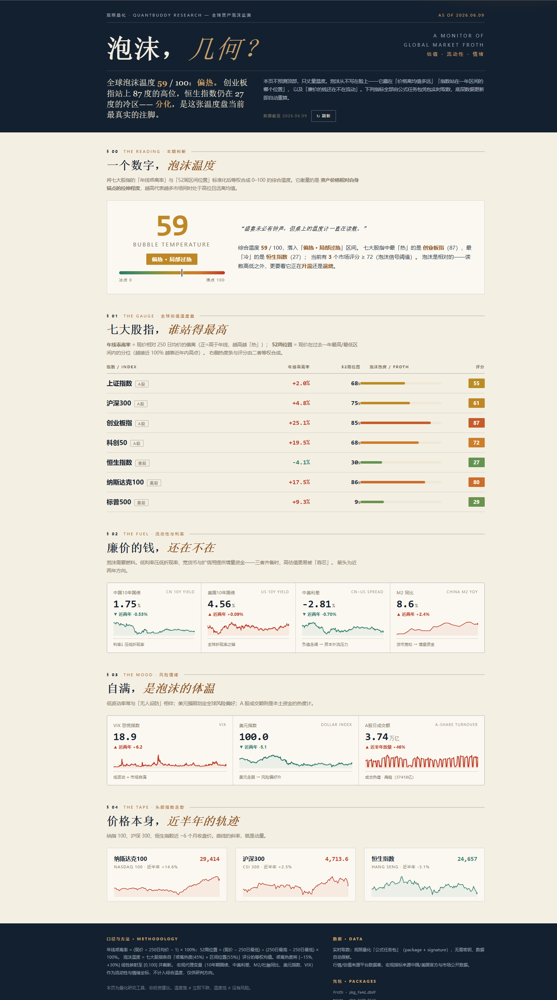
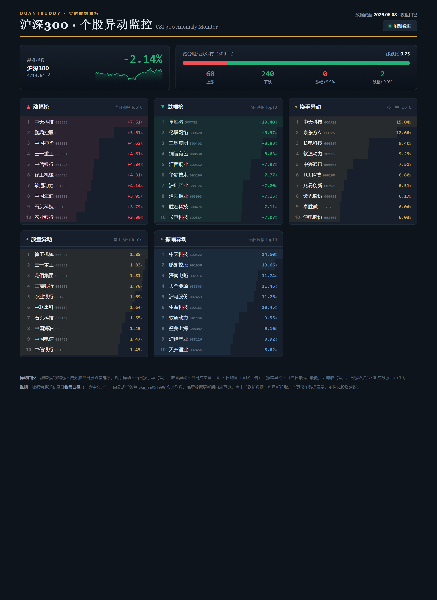

# quant-buddy-data

[中文](README.md) | [English](README.en.md)

<p align="center">
  
</p>

Let Claude Code, Cursor, Codex, GitHub Copilot, Windsurf, and other AI agents query A-share, Hong Kong, and US stock market data, valuation data, and financial data directly.

No API wiring, no giant tables in the prompt, no CSV cleaning. Ask in natural language and get structured financial data back.

Official site: https://www.quantbuddy.cn

> This project is for financial data analysis, quantitative research, strategy validation, and educational use only. It is not investment advice, trading advice, a return guarantee, or an automated trading service.

## Quick Install

If you are familiar with AI agent tools, tell your agent:

> Install this skill for me:

```bash
npx skills add pseudo-longinus/quant-buddy-data -g -a claude-code -s quant-buddy-skill -y
```

For Cursor:

```bash
npx skills add pseudo-longinus/quant-buddy-data -g -a cursor -s quant-buddy-skill -y
```

For OpenClaw:

```bash
npx skills add pseudo-longinus/quant-buddy-data -g -a openclaw -s quant-buddy-skill -y
```

> The first version keeps `quant-buddy-skill` as the skill name for compatibility with the existing tool protocol.

## 30-Second Examples

After installation, ask your AI agent:

```text
Check Kweichow Moutai's latest close, daily return, PE, and PB.
```

```text
Show CATL's latest reported revenue, net profit, and ROE.
```

```text
Compare Apple, Nvidia, and Tesla over the past 20 trading days.
```

```text
Export BYD's close price and turnover for the past 60 trading days.
```

The agent turns your natural-language request into quant-buddy platform queries and returns structured results, time series, or CSV files.

## What It Can Do

| Capability | Coverage | Examples |
|---|---|---|
| Latest market data | A-shares / HK stocks / US stocks / indices | Latest price, close, return, turnover, volume |
| Valuation data | PE/PE_TTM/PB/PS_TTM/dividend yield/PCF across A/HK/US; market cap, float cap, turnover are A-shares only | PE, PB, PS, dividend yield, market cap |
| Financial data | A/HK/US supported (single-quarter); some fields depend on API response | Revenue, net profit, ROE, total assets, debt ratio |
| Money flow / North-South holdings | Main-force net flow & buckets and northbound holdings are A-shares only; southbound holdings are HK only | Main-force / super-large / large / medium / small net flow, northbound & southbound holdings |
| Commodity futures | A-share futures only (~60 products), unit varies by product | Futures OHLC, spot price, inventory |
| Recent N-day series | Single asset or explicit asset lists | 5-day, 20-day, 60-day prices and returns |
| Fixed-period comparison | Multi-asset return comparison | Cumulative return from one date to another |
| CSV export | Query results and history series | Save locally for spreadsheets or downstream analysis |
| Macro data | GDP, CPI, PPI, PMI, M1/M2, social financing, credit, FX reserves, Treasury yields, LPR, OMO, USD/CNH, industrial output, retail sales, trade | Search with `confirmDataMulti` to find the data name, such as `中国GDP当季同比`, `中国CPI同比`, `中国PPI同比`, `中采PMI`, `中国新增社融`, and `USDCNH`, then read with `readData` |
| Advanced computation | Mainly A-shares | Formulas, full-market screening, factors, backtests, charts |

## Why Not Just Another Data API

Most data APIs require you to write code, look up field names, handle parameters, and clean returned data.

quant-buddy-data aims for a shorter path: let an AI agent understand the question and call the platform for data retrieval and computation.

```text
You ask in natural language
        ↓
The agent identifies assets, fields, and time ranges
        ↓
quant-buddy queries and computes on the platform side
        ↓
You get structured results, tables, time series, or CSV
```

It is useful when:

- You want your AI coding tool to query financial data directly.
- You do not want thousands of raw rows in the LLM context.
- You need reusable, auditable data-query workflows.
- You want to start with data lookup and later move into screening, factors, or backtesting.

## Common Prompts

### Single Stock

```text
Check Kweichow Moutai's latest close, daily return, turnover, PE, and PB.
```

### Multiple Stocks

```text
Compare CATL, BYD, and Sungrow by latest close and market cap.
```

### Recent N Trading Days

```text
List Tencent's close price and daily return over the past 20 trading days.
```

### Financial Metrics

```text
Check Apple's latest reported revenue, net profit, and gross margin.
```

### Export Data

```text
Export Kweichow Moutai's close price for the past 120 trading days as CSV.
```

### Advanced Analysis

```text
Screen all A-shares for low PE, high ROE, and strong 20-day return.
```

```text
Backtest a low PE + high ROE portfolio and compare it with CSI 300.
```

## Data Coverage

| Market | Market Data | Valuation | Financials | Screening / Backtesting |
|---|---|---|---|---|
| A-shares | Supported | Supported | Supported | Supported |
| Hong Kong stocks | Supported | Partially supported, depending on API response | Partially supported, depending on API response | Data lookup first |
| US stocks | Supported | Partially supported, depending on API response | Partially supported, depending on API response | Data lookup first |
| Major indices | Supported | Partially supported | - | Can be used as benchmarks or comparison assets |
| Commodity futures | Futures OHLC, spot price, inventory (~60 A-share futures products, unit by product) | - | - | A-share futures only; valuation/financials/K-line not covered |
| Macro data | Supported via `confirmDataMulti` + `readData` | - | - | Search with `confirmDataMulti` to find the data name, for example `中国GDP当季同比`, `中国CPI同比`, `中国PPI同比`, `中采PMI`, `中国M1同比`, `中国M2同比`, `中国新增社融`, `中国新增人民币贷款`, `中国外汇储备`, `中国10年国债收益`, `中国1年期LPR`, `中国7天逆回购利率`, and `USDCNH` |

**Common limits**: up to 1,000 assets per request, window series up to 2,500 trading days (~10 years), history back to 2005-01-04, up to 200,000 data points per request; daily caps of 1,000,000 data points and 50 CSV downloads. Results over 500 data points automatically switch to CSV download links. A-share main-force/northbound money flow and southbound holdings are queried with `snapshot`/`window` (not `report`).

## Formula Packages (Register Formulas → Serve Data Without an API Key)

`fast_query` covers "I need data for myself." **Formula Packages** cover "I've fixed a set of metrics — now let a web page / dashboard / third party keep pulling their latest values."

You register a batch of formulas once and get a pair of credentials (`package_id` + `signature`). After that, any page or program can use those credentials to fetch **always-fresh** results: whenever the underlying data updates, the server recomputes automatically. No re-running formulas, no backend to host, and no API Key in the front end.

**Use cases**

- **Build your own daily report / dashboard**: turn the metrics you check every day (returns, valuation percentiles, money flow, custom factor scores, …) into one package, then `fetch` and render them from a single static HTML page. Open the page and you see today's data — **no backend, no manual recompute**.
- **Give a team / client a read-only data page**: hand out the `package_id` + `signature`, not your API Key. They can only read the outputs you fixed — they can't change the formulas or touch your account. Revoke any time.
- **Embed into an existing site / Notion / Feishu / a wall display**: anywhere `fetch` runs, you can read and render the data directly inside your own page.
- **Third-party / lightweight integration**: hand a precomputed metric package to a partner for read-only access; billing always stays on your (the owner's) quota, and they integrate with zero config.

Two steps:

1. **Register** (needs API Key): submit a set of formulas plus a read mode for each output; the server runs and validates them, then returns a `package_id` + `signature`.
2. **Query** (**no API Key**): pull data with `package_id` + `signature`; results stream back as SSE. When the underlying data updates, the server **recomputes automatically** so a query always returns the latest result — never stale data.

> The `signature` is the access credential. It is returned in plaintext **only once**, in the register response (the script also saves it to `output/formula_packages/<package_id>.json`). The query side needs no API Key; usage is billed to the **package owner**.

### What you can build: two real pages powered by formula packages

Both pages below are **plain static HTML** — no backend, no database. They just `fetch` a formula package in the browser and render the returned `outputs` into tables and charts. Whenever the underlying data updates, a page refresh shows today's latest values, and the **API Key never touches the front end**.

<p align="center">
  
  <br/>
  <sub><b>Global market-temperature dashboard</b> · seven major indices, a market-wide valuation "bubble temperature", plus commodity and bond trends — the whole page comes from a single formula-package query.</sub>
</p>

<p align="center">
  
  <br/>
  <sub><b>CSI 300 anomaly monitor</b> · gainers / losers, turnover &amp; volume anomalies, and six-month price tracks — rendered from the same single <code>fetch</code>.</sub>
</p>

> ⚠️ These pages are **illustrative demos** of formula packages. All figures are historical / sample data and **do not constitute any investment or trading advice**.

### Call via the local script

```powershell
cd skills/quant-buddy-skill

# 1. Register: put formulas + reads in params.json (pass Chinese formulas with @file to avoid encoding truncation)
python scripts/formula_package.py register @params.json

# 2. Query: only package_id is required; signature is auto-filled from the local credential
$env:FP_PARAMS='{"package_id":"pkg_xxx"}'
python scripts/formula_package.py query

# Manage: list / revoke / refresh (rotate signature)
python scripts/formula_package.py list    '{"page":1,"page_size":20}'
python scripts/formula_package.py revoke  '{"package_id":"pkg_xxx"}'
python scripts/formula_package.py refresh '{"package_id":"pkg_xxx","rotate_signature":true}'
```

Example `params.json` for registration:

```json
{
  "formulas": [
    "T_px = \"全市场每日收盘价\" * 1",
    "T_ma5 = 平均(\"T_px\", 5)",
    "T_ratio = \"T_px\" / \"T_ma5\""
  ],
  "reads": [
    { "output": "T_px",    "read_mode": "range_data", "mode_params": { "start_date": 20240601, "end_date": 20240630 } },
    { "output": "T_ratio", "read_mode": "last_day_stats" }
  ],
  "ttl_days": 365
}
```

- Formulas not listed in `reads` (e.g. `T_ma5` above) are intermediate variables — computed but not exposed.
- Different outputs in the same package can use **different read modes**: `range_data` (full series over a date range) / `last_day_stats` (latest cross-section stats) / `last_valid_per_asset` (last valid value per asset).
- Up to 100 formulas and 20 exposed outputs per package; default validity 365 days (set `ttl_days` at registration).

### Query directly from a front end / third party (no API Key)

The snippet below is the core of "your own daily-report page": drop it into a static HTML file, fetch with the credentials, and render `outputs` into tables / charts — every visit shows today's latest data. The query endpoint streams SSE; in the browser, read the stream with `fetch` (signature goes in the body, never the URL; do not use `EventSource`):

```js
const resp = await fetch('https://www.quantbuddy.cn/skill/queryFormulaPackage', {
  method: 'POST',
  headers: { 'Content-Type': 'application/json' },
  body: JSON.stringify({ package_id, signature }),
})
const reader = resp.body.getReader()
const decoder = new TextDecoder()
const outputs = {}
let buf = ''
for (;;) {
  const { value, done } = await reader.read()
  if (done) break
  buf += decoder.decode(value, { stream: true })
  const blocks = buf.split('\n\n'); buf = blocks.pop()
  for (const block of blocks) {
    const ev = (block.match(/event:\s*(.*)/) || [])[1]
    const dt = JSON.parse((block.match(/data:\s*([\s\S]*)/) || [])[1])
    if (ev === 'result') outputs[dt.output] = dt        // outputs["T_px"].data ...
    else if (ev === 'error') throw new Error(`${dt.code}: ${dt.message}`)
  }
}
```

Quick check with curl:

```bash
curl -N -X POST https://www.quantbuddy.cn/skill/queryFormulaPackage \
  -H 'Content-Type: application/json' \
  -d '{"package_id":"pkg_xxx","signature":"a1b2c3..."}'
```

> Register / list / revoke / refresh need an API Key and **must stay server-side**; only the query endpoint (`queryFormulaPackage`) is safe to expose to a browser. For full parameters, read-mode result structures, and error codes see `skills/quant-buddy-skill/tools/formula_package.md`; end-to-end usage is in `recipes/formula-package.md`.

## Installation

New users should install the skill only into the AI agent they actually use. Avoid using `--all` by default.

| Agent | Recommended command |
|---|---|
| Claude Code | `npx skills add pseudo-longinus/quant-buddy-data -g -a claude-code -s quant-buddy-skill -y` |
| Cursor | `npx skills add pseudo-longinus/quant-buddy-data -g -a cursor -s quant-buddy-skill -y` |
| OpenClaw | `npx skills add pseudo-longinus/quant-buddy-data -g -a openclaw -s quant-buddy-skill -y` |

If you use multiple agents, repeat `-a`:

```bash
npx skills add pseudo-longinus/quant-buddy-data -g -s quant-buddy-skill -a claude-code -a cursor -y
```

List the skills in this repository:

```bash
npx skills add pseudo-longinus/quant-buddy-data --list
```

Update an existing installation:

```bash
npx skills update quant-buddy-skill -g -y
```

If Windows users encounter symlink or permission errors, add `--copy`:

```bash
npx skills add pseudo-longinus/quant-buddy-data -g -a claude-code -s quant-buddy-skill -y --copy
```

## Configure API Key

Before first use, configure your quant-buddy API key:

1. Go to https://www.quantbuddy.cn to register and get an API key.
2. Edit `config.json` under the skill directory and fill in the `api_key` field.
3. Or send this to an agent environment that can write local files:

```text
Help me configure APIkey: sk-xxxxxxxx
```

## Runtime Requirements

- Python 3.8+, Python 3.11 recommended.
- Core market data, valuation, financials, series, screening, and backtesting features only depend on the Python standard library.
- Optional dependencies:
  - `python-dateutil`: used by event-study helpers.
  - `Pillow`: used for chart image conversion.
  - `requests`: used by optional event-news search helpers.
- Optional environment variable: `BOCHA_API_KEY`, only used by event-news search helpers.

## Security, Privacy, And Disclaimer

- The quant-buddy API key is only used to request quant-buddy platform APIs.
- The API key is only sent as an HTTP `Authorization` header to declared quant-buddy domains. It is not written to logs and is not forwarded to third-party hosts.
- This project is for financial data analysis, quantitative research, strategy validation, and educational use only. It is not investment advice, trading advice, a return guarantee, or an automated trading service.
- Users should independently verify data definitions, costs, risk exposure, and compliance requirements.

## Troubleshooting

- Environment dependencies: `skills/quant-buddy-skill/references/environment.md`
- Troubleshooting: `skills/quant-buddy-skill/references/troubleshooting.md`
- RU billing: `skills/quant-buddy-skill/references/ru-billing.md`

## Relationship With quant-buddy-skills

`quant-buddy-data` is the low-friction entry point for financial data lookup from AI agents.

It reuses the underlying `quant-buddy-skill`, so advanced features such as full-market screening, formulas, factors, backtests, and charts are still available. The first version simply makes the data-query use case much easier to understand.

## Contact

For data-query examples, integration questions, and AI agent workflows, scan the QR codes below to connect or join the community.

<p align="center">
  <table>
    <tr>
      <td align="center">
        
        <br/>
        <sub>Personal WeChat</sub>
      </td>
      <td align="center">
        
        <br/>
        <sub>WeChat Group</sub>
      </td>
      <td align="center">
        
        <br/>
        <sub>Feishu Group</sub>
      </td>
    </tr>
  </table>
</p>

## License

MIT
