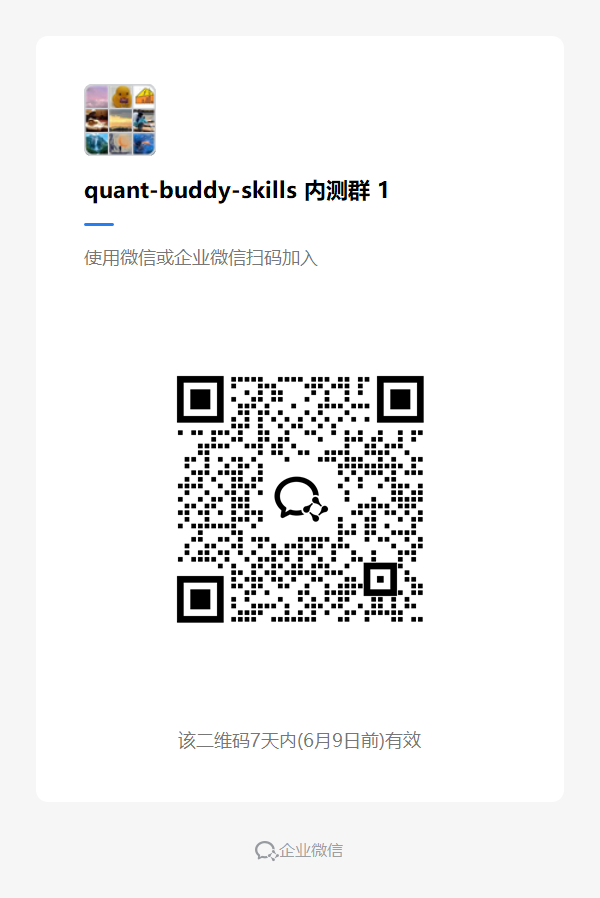

# quant-buddy-data

[中文](README.md) | [English](README.en.md)

<p align="center">
  
</p>

让 Claude Code、Cursor、Codex、GitHub Copilot、Windsurf 等 AI Agent 直接查询 A 股、港股、美股行情、估值、财务数据和历史序列。

不用写 API，不用清洗 CSV，不用把大表塞进模型上下文。你用自然语言提问，Agent 调用 quant-buddy 返回结构化数据。

官网：https://www.quantbuddy.cn

> 本项目用于金融数据分析、量化研究、策略验证和教育用途，不构成投资建议、交易建议、收益承诺或自动交易服务。

## 3 秒快速安装

如果你熟悉 Agent 工具（Claude Code、Cursor、OpenClaw 等），可以直接对 AI Agent 说：

> 帮我安装这个 skill：

```bash
npx skills add pseudo-longinus/quant-buddy-data -g -a claude-code -s quant-buddy-skill -y
```

如果你不懂如何使用 Agent 和 skill，可以按照[小白图文教程](https://tcn8bvcbyokw.feishu.cn/wiki/E1zswck3oiiJjJkP07QcmSG3nle?from=from_copylink)一步步展开。

## 你可以这样问

```text
查贵州茅台最新收盘价、涨跌幅、PE、PB。
```

```text
查宁德时代最近报告期营收、净利润、ROE。
```

```text
对比苹果、英伟达、特斯拉最近 20 个交易日涨跌幅。
```

```text
导出比亚迪最近 60 个交易日的收盘价和成交额。
```

```text
筛选全 A 股中低 PE、高 ROE、近 20 日涨幅靠前的股票。
```

## 核心能力

| 能力 | 示例 |
|---|---|
| 最新行情 | 最新价、收盘价、涨跌幅、成交额、成交量 |
| 估值数据 | PE、PB、PS、股息率、市值 |
| 财务数据 | 营收、净利润、ROE、总资产、资产负债率 |
| 时间序列 | 最近 N 个交易日价格、收益、成交额 |
| 区间对比 | 多资产固定区间累计涨跌幅 |
| CSV 导出 | 将历史序列或查询结果保存到本地 |
| 进阶分析 | 全市场筛选、公式计算、因子、回测、图表 |

## 数据覆盖

| 市场 | 行情 | 估值 | 财务 | 进阶分析 |
|---|---|---|---|---|
| A 股 | 支持 | 支持 | 支持 | 支持 |
| 港股 | 支持 | 部分支持 | 部分支持 | 以数据查询为主 |
| 美股 | 支持 | 部分支持 | 部分支持 | 以数据查询为主 |
| 指数 | 支持 | 部分支持 | - | 可作为基准或对比对象 |

港股、美股的估值和财务字段以接口实际返回为准。

## 配置 API Key

首次使用前需要配置 quant-buddy API Key：

1. 前往 https://www.quantbuddy.cn 注册并获取 API Key。
2. 编辑 skill 目录下的 `config.json`，将 `api_key` 填入你的 Key。
3. 或直接对支持写文件的 AI Agent 说：

```text
帮我配置 APIkey：sk-xxxxxxxx
```

## 更新

```bash
npx skills update quant-buddy-skill -g -y
```

查看安装位置：

```bash
npx skills list -g --json
```

## 运行环境

- Python 3.8+，推荐 Python 3.11。
- 核心能力仅依赖 Python 标准库。
- 可选依赖：`python-dateutil`、`Pillow`、`requests`。

## 和 quant-buddy-skills 的关系

`quant-buddy-data` 是面向“AI Agent 查金融数据”的低门槛入口，底层复用 `quant-buddy-skill`。除了快速查数，也保留全市场筛选、公式、因子、回测和图表等进阶能力。

## 安全与免责声明

- API Key 仅用于请求 quant-buddy 平台接口。
- API Key 只作为 HTTP `Authorization` 头发送到 quant-buddy 声明域名，不写入日志，不转发给第三方主机。
- 本项目不提供投资建议、交易建议、收益承诺或自动交易服务。
- 用户应自行核验数据口径、风险暴露和合规要求。

## 联系作者

想看更多数据查询案例、接入问题和 AI Agent 工作流，欢迎添加微信或加入交流群。

<p align="center">
  <table>
    <tr>
      <td align="center">
        
        <br/>
        <sub>个人微信</sub>
      </td>
      <td align="center">
        
        <br/>
        <sub>微信群</sub>
      </td>
      <td align="center">
        
        <br/>
        <sub>飞书群</sub>
      </td>
    </tr>
  </table>
</p>

## License

MIT
